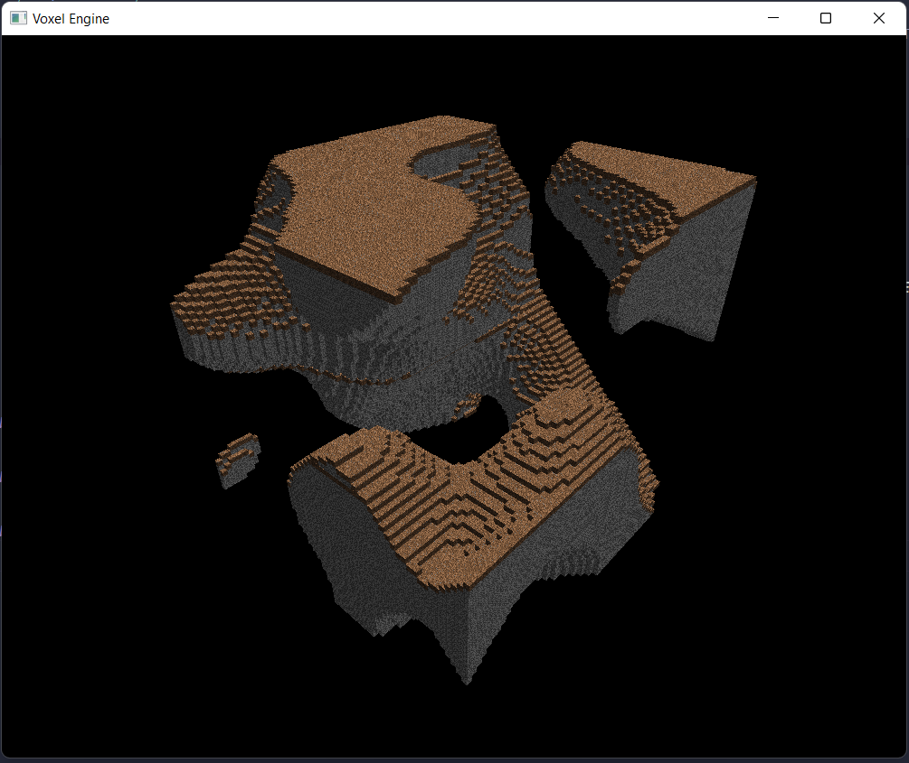

LWJGL Voxel Engine
---

### Description
Voxel engine made using LWJGL-3 and Java 17.

### TODO
- [X] 2D texture arrays
- [X] Greedy meshing algorithm
- [X] Perlin noise terrain generation
- [ ] Chunk manager + Infinite generation
- [ ] Global illumination
- [ ] Physics engine
- [ ] Mouse picking
- [ ] Modifiable chunks
- [ ] Occlusion culling